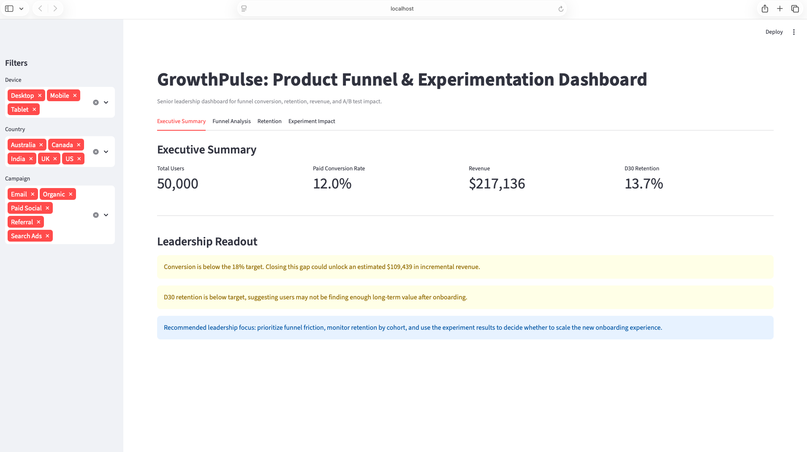

# 📊 GrowthPulse: Product Analytics & Experimentation Dashboard

A senior-level product analytics dashboard built using SQL, Python, and Streamlit to analyze user funnel performance, retention behavior, and A/B testing impact.

---

## 🚀 Project Overview

This project simulates how product and growth teams evaluate user behavior to drive business decisions.

It answers key leadership questions:

* Where are users dropping off in the funnel?
* Which segments are underperforming?
* How strong is user retention across cohorts?
* Did the experiment improve conversion?
* What is the revenue opportunity from optimization?

---

## 🧩 Dashboard Structure

### 🟢 Executive Summary

* KPI tracking: Users, Conversion Rate, Revenue, Retention
* Business health indicators
* Revenue opportunity estimation vs target conversion
* Leadership recommendations

---

### 🔵 Funnel Analysis

* Full user funnel: Visit → Signup → Activation → Purchase
* Step-level drop-off identification
* Segment-level performance (Device, Country, Campaign)
* Worst-performing segment detection
* Revenue opportunity by segment (high-impact insight)

---

### 🟣 Retention Analysis

* D1, D7, D30 retention tracking
* Monthly cohort retention heatmap
* Retention trend evaluation for long-term engagement

---

### 🟠 Experiment Impact (A/B Testing)

* Control vs Variant comparison
* Conversion rate and lift %
* Statistical significance testing (p-value)
* Clear rollout recommendation for leadership

---

## 📈 Key Insights Generated

* Identified highest drop-off stage in funnel indicating onboarding friction
* Detected underperforming segments driving conversion loss
* Quantified revenue opportunity from improving conversion rates
* Evaluated A/B test performance with statistical rigor
* Analyzed cohort-based retention trends to assess product stickiness

---

## 🛠️ Tech Stack

* **Python** (Pandas, NumPy)
* **SQL (SQLite)** for structured data simulation
* **Streamlit** for interactive dashboard
* **Plotly** for visualizations
* **SciPy** for statistical testing

---

## 📊 Data Simulation

Synthetic dataset generated to mimic real-world product analytics scenarios:

* 50K+ users
* Multi-step funnel behavior
* Experiment groups (Control vs Variant)
* Retention events (Day 1, 7, 30)
* Purchase transactions

---

## ▶️ How to Run

```bash
git clone https://github.com/YOUR_USERNAME/growthpulse-product-analytics-dashboard.git
cd growthpulse-product-analytics-dashboard

python3 -m venv venv
source venv/bin/activate

pip install -r requirements.txt

python scripts/generate_data.py
streamlit run app.py
```

---

## 📸 Dashboard Preview




---

## 💡 Why This Project Matters

This project demonstrates how analytics is used beyond reporting to:

* drive product decisions
* prioritize growth opportunities
* quantify business impact
* support leadership-level decision making

---

## 📌 Author

Aman Sachdeva
